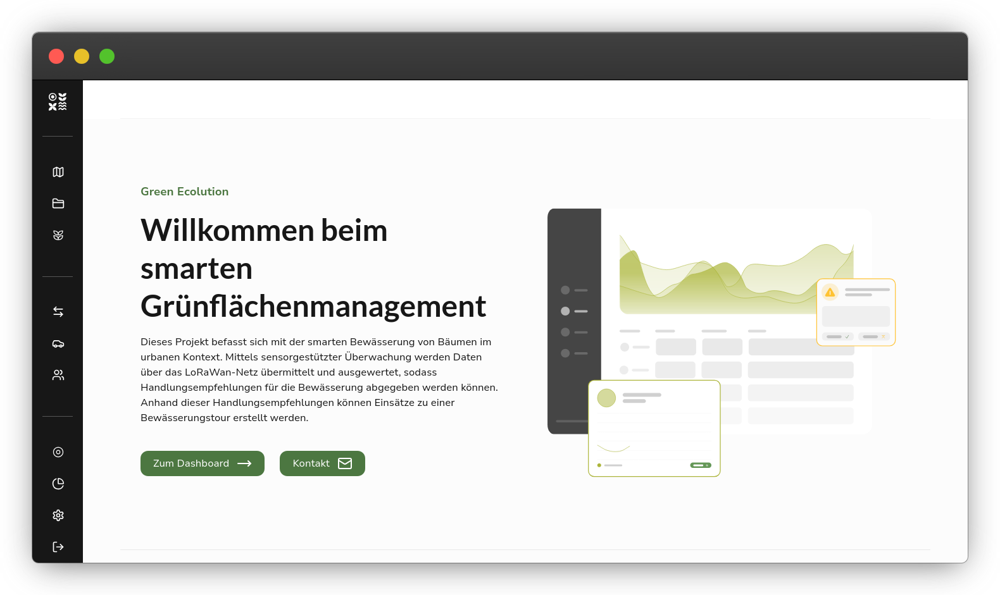

<p>
  <a href="https://github.com/green-ecolution/green-ecolution/releases">
    
  </a>
  
  
  
  <a href="https://pkg.go.dev/github.com/green-ecolution/green-ecolution/backend">
    
  </a>
</p>

# :seedling: Green Ecolution

Urban green spaces need water - but how much, and when? City maintenance teams often drive fixed routes, watering trees on schedule rather than based on actual need. This wastes water, fuel, and staff time.

**Green Ecolution** changes that. Soil moisture sensors (LoRaWAN) report real-time data to our platform, which calculates optimized watering routes. Teams see exactly which trees need attention, plan efficient routes, and manage their fleet - all in one place.



## What it does

- 🌳 **Tree management** - Track trees and tree clusters, monitor their watering status
- 📡 **Sensor integration** - Receive soil moisture data via LoRaWAN/MQTT in real-time
- 🗺️ **Route optimization** - Generate efficient watering routes using Valhalla + Vroom
- 🚛 **Fleet management** - Manage vehicles, assign drivers, track watering plans
- 📊 **Analytics** - Evaluate water consumption and team performance

## Quick Start

The fastest way to run everything locally:

```bash
make infra/up    # Start Postgres, Keycloak, MinIO, Valhalla, etc.
make run/live    # Run backend with hot reload
```

Frontend dev server (in a second terminal):

```bash
make fe/dev
```

Open [http://localhost:3000](http://localhost:3000).

## Setup

### Requirements

- Go (with CGO enabled)
- Node.js + pnpm (`corepack enable`)
- Docker + Docker Compose

### Installation

```bash
make setup       # Install Go and pnpm dependencies
make build       # Build frontend + backend
```

### Common Commands

| Command | Description |
|---------|-------------|
| `make run/live` | Backend with hot reload |
| `make fe/dev` | Frontend dev server |
| `make test` | Run all tests |
| `make lint` | Lint Go + frontend |
| `make generate` | Run code generation (sqlc, mappers, swagger) |
| `make migrate/up` | Apply database migrations |
| `make migrate/new name=...` | Create new migration |

> 💡 For a reproducible dev environment, you can also use `nix develop`.

### Services

When running `make infra/up`, these services are available via Traefik:

| Service | URL |
|---------|-----|
| Backend API | <http://localhost:3000> |
| Keycloak | <http://auth.localhost:3000> |
| MinIO Console | <http://minio.localhost:3000> |
| pgAdmin | <http://pgadmin.localhost:3000> |
| Valhalla | <http://valhalla.localhost:3000> |

## Architecture

```
backend/    → Go (Fiber, sqlc, pgx) - REST API, MQTT subscriber, auth
frontend/   → React (Vite, TanStack Router/Query, Zustand, Tailwind)
```

The backend embeds the compiled frontend and serves it as a single binary.

## Configuration

All settings via environment variables (prefix `GE_`) or YAML files in `backend/config/`.

Key areas: `server.database.*`, `auth.oidc_provider.*`, `routing.*`, `s3.*`, `mqtt.*`

See `compose.app.yaml` for examples.

## Contributing

1. Fork this repository
2. Create a branch from `main`
3. Commit using [Conventional Commits](https://www.conventionalcommits.org/)
4. Open a Pull Request

We use [Git-Flow](https://danielkummer.github.io/git-flow-cheatsheet/) for branching.

## Links

- 🌐 [Website](https://green-ecolution.de)
- 🖥️ [Live Demo](https://demo.green-ecolution.de)
- 📘 [API Docs](https://app.green-ecolution.de/api/v1/swagger/index.html)
- 🧑‍💻 [GitHub](https://github.com/green-ecolution)
