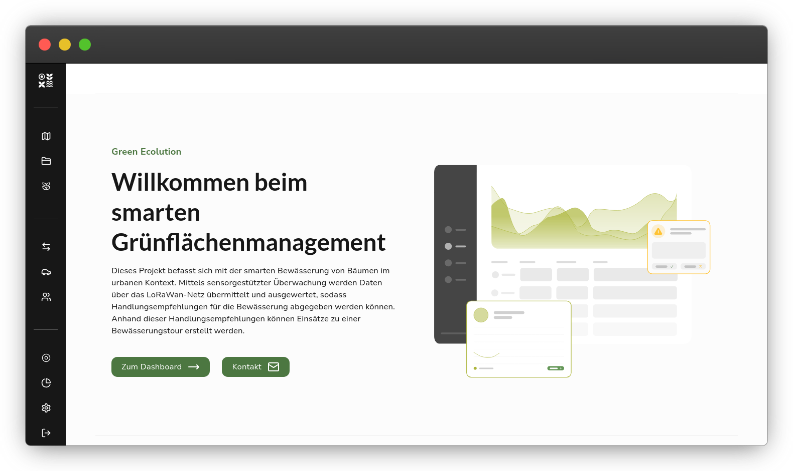

<p>
  <a href="https://github.com/green-ecolution/green-ecolution/releases">
    
  </a>
  
  
  
  <a href="https://pkg.go.dev/github.com/green-ecolution/green-ecolution/backend">
    
  </a>
</p>

# :seedling: Green Ecolution

Urban green spaces need water - but how much, and when? City maintenance teams often drive fixed routes, watering trees on schedule rather than based on actual need. This wastes water, fuel, and staff time.

**Green Ecolution** changes that. Soil moisture sensors (LoRaWAN) report real-time data to our platform, which calculates optimized watering routes. Teams see exactly which trees need attention, plan efficient routes, and manage their fleet - all in one place.



## What it does

- 🌳 **Tree management** - Track trees and tree clusters, monitor their watering status
- 📡 **Sensor integration** - Receive soil moisture data via LoRaWAN/MQTT in real-time
- 🗺️ **Route optimization** - Generate efficient watering routes using Valhalla + Vroom
- 🚛 **Fleet management** - Manage vehicles, assign drivers, track watering plans
- 📊 **Analytics** - Evaluate water consumption and team performance

## Quick Start

The fastest way to run everything locally:

```bash
just run-dev     # Start infra, run migrations, launch backend + frontend
```

Open [http://localhost:3000](http://localhost:3000).

### With HTTPS (Let's Encrypt)

For valid TLS certificates (required for PWA testing on mobile), you need a domain with DNS API access on [Porkbun](https://porkbun.com). Either ask the `green-ecolution.dev` domain owner for API keys, or register your own domain on Porkbun and set `DOMAIN=your-domain.dev` in `.env`.

1. Copy `.env.example` to `.env` and add your Porkbun API keys (and optionally `DOMAIN`)
2. Create DNS records: `just dns-setup`
3. Start dev environment: `just run-dev`

Open `https://<your-ip>.green-ecolution.dev:3443` (or your custom domain).

## Setup

### Requirements

- Go (with CGO enabled)
- Node.js + pnpm (`corepack enable`)
- Docker + Docker Compose

### Installation

```bash
just setup       # Install Go and pnpm dependencies
just build       # Build frontend + backend
```

### Common Commands

| Command | Description |
|---------|-------------|
| `just run-dev` | Backend + frontend dev via Traefik |
| `just run-live` | Backend with hot reload (standalone) |
| `just run-docker` | Full stack via Docker Compose |
| `just infra-up` | Start infrastructure only |
| `just dns-setup` | Create Porkbun DNS records for HTTPS |
| `just dns-cleanup` | Remove Porkbun DNS records |
| `just test` | Run all tests |
| `just lint` | Lint Go + frontend |
| `just generate` | Run code generation (sqlc, mappers, swagger) |
| `just migrate-up` | Apply database migrations |
| `just migrate-new name=...` | Create new migration |

> For a reproducible dev environment, you can also use `nix develop`.

### Services

When running `just infra-up`, these services are available via Traefik:

**Without Porkbun keys** (HTTP on port 3000):

| Service | URL |
|---------|-----|
| Backend API | <http://localhost:3000/api> |
| Keycloak | <http://auth.localhost:3000> |
| MinIO Console | <http://minio.localhost:3000> |
| pgAdmin | <http://pgadmin.localhost:3000> |
| Valhalla | <http://valhalla.localhost:3000> |

**With Porkbun keys** (HTTPS on port 3443, valid Let's Encrypt certs):

| Service | URL |
|---------|-----|
| Backend API | `https://<ip>.green-ecolution.dev:3443/api` |
| Keycloak | `https://auth.<ip>.green-ecolution.dev:3443` |
| MinIO Console | `https://minio.<ip>.green-ecolution.dev:3443` |
| pgAdmin | `https://pgadmin.<ip>.green-ecolution.dev:3443` |
| Valhalla | `https://valhalla.<ip>.green-ecolution.dev:3443` |

## Architecture

```
backend/    → Go (Fiber, sqlc, pgx) - REST API, MQTT subscriber, auth
frontend/   → React (Vite, TanStack Router/Query, Zustand, Tailwind)
```

The backend embeds the compiled frontend and serves it as a single binary.

## PWA

The frontend is installable as a Progressive Web App with offline support via a Workbox service worker.

### HTTPS with valid certificates

PWA features like service workers require HTTPS. The project uses [Let's Encrypt](https://letsencrypt.org/) with DNS-01 challenge via [Porkbun](https://porkbun.com) to obtain valid TLS certificates for local development.

```bash
# 1. Add Porkbun API keys to .env (see .env.example)
# 2. Create DNS records pointing to your local IP
just dns-setup

# 3. Start dev environment (HTTPS on port 3443)
just run-dev
```

Your local IP is auto-detected. Access the app at `https://<ip>.green-ecolution.dev:3443`.

### Mobile testing

With HTTPS enabled, the app is accessible from any device on the local network. No certificate installation needed since Let's Encrypt certs are trusted by default.

- Frontend: `https://<ip>.green-ecolution.dev:3443`
- Auth: `https://auth.<ip>.green-ecolution.dev:3443`

### Without HTTPS

Without Porkbun API keys, the dev environment runs on plain HTTP (port 3000). PWA install and service workers won't work, but general development is unaffected.

```bash
just run-dev   # HTTP on localhost:3000
```

### Testing the service worker

The service worker is **disabled in `vite dev`** (`devOptions.enabled: false` in `vite.config.ts`) to avoid HMR conflicts with Workbox precaching. To verify PWA behavior (install prompt, update flow, offline fallback), build and serve the production bundle:

```bash
cd frontend/app && pnpm build && pnpm preview
```

…or run the full Docker stack via `just run-docker`.

## Configuration

All settings via environment variables (prefix `GE_`) or YAML files in `backend/config/`.

Key areas: `server.database.*`, `auth.oidc_provider.*`, `routing.*`, `s3.*`, `mqtt.*`

See `compose.app.yaml` for examples.

## Contributing

1. Fork this repository
2. Create a branch from `main`
3. Commit using [Conventional Commits](https://www.conventionalcommits.org/)
4. Open a Pull Request

We use [Git-Flow](https://danielkummer.github.io/git-flow-cheatsheet/) for branching.

## Links

- 🌐 [Website](https://green-ecolution.de)
- 🖥️ [Live Demo](https://demo.green-ecolution.de)
- 📘 [API Docs](https://app.green-ecolution.de/api/v1/swagger/index.html)
- 🧑‍💻 [GitHub](https://github.com/green-ecolution)
